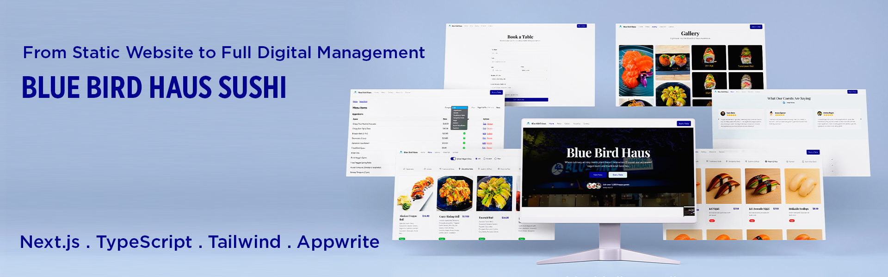

# Blue Bird Haus Sushi Website

A fully manageable website for **Blue Bird Haus Sushi**, allowing the restaurant owner to update menus, upload photos, and handle customer bookings — fast, scalable, and optimized for real-world use.

## 🚀 Live Demo

[https://www.bluebirdhaus.online/](https://www.bluebirdhaus.online/)

## 📂 GitHub Repository

[GitHub](https://github.com/SawSimonLinn/bluebirdhaussushi)

---

## Features

- **Online Menu Management** – Add, edit, and delete menu items anytime without touching the code.
- **Image Upload** – Upload and display food photos directly on the menu.
- **Category System** – Organize items into clear categories for easy browsing.
- **Photo Gallery** – Showcase dishes and restaurant ambiance in a visual gallery.
- **Booking System** – Customers can reserve tables, with confirmation and cancellation emails sent to both admin and customer.
- **Admin Panel** – Simple, secure dashboard for managing all content.
- **Responsive Design** – Works smoothly on desktop, tablet, and mobile.
- **Faster Runtime** – Loads **40% faster** than the old website for a smoother user experience.
- **Custom Hosting & Domain** – Hosted on a Hostinger domain: [bluebirdhaus.online](https://www.bluebirdhaus.online/).

---

## 🛠 Tech Stack

- **Frontend:** Next.js, TypeScript, Tailwind CSS
- **Backend & Database:** Appwrite
- **Email Service:** Resend
- **Analytics:** Plausible Analytics
- **Hosting:** Hostinger
- **Image Handling:** Appwrite Storage

---

## ⚡ Challenges & Solutions

- **Image Storage Errors (404)** – Fixed by configuring Appwrite permissions & updating Next.js image settings.
- **Dynamic Menu Updates** – Integrated Appwrite database queries to update menu items in real-time without code changes.
- **Booking System Emails** – Built automated email notifications for both admin and customers using Resend.
- **Performance Optimization** – Improved API calls & image handling to achieve 40% faster load time.

---

## 📚 Key Takeaways

This project demonstrated the power of combining **Next.js + Appwrite** to create a self-managed business website that removes the need for ongoing developer intervention—saving the client time and money.

---

## 📦 Installation & Setup

1. Clone the repository:
   ```bash
   git clone https://github.com/SawSimonLinn/bluebirdhaussushi
   cd <project-folder>
   ```
2. Install dependencies:
   ```bash
   npm install
   ```
3. Set up environment variables in `.env.local`:
   ```env
   NEXT_PUBLIC_APPWRITE_PROJECT_ID=your_project_id
   NEXT_PUBLIC_APPWRITE_ENDPOINT=your_appwrite_endpoint
   NEXT_PUBLIC_APPWRITE_DATABASE_ID=your_database_id
   NEXT_PUBLIC_MENU_COLLECTION_ID=your_menu_collection_id
   NEXT_PUBLIC_GALLERY_COLLECTION_ID=your_gallery_collection_id
   NEXT_PUBLIC_MENU_BUCKET_ID=your_menu_bucket_id
   NEXT_PUBLIC_GALLERY_BUCKET_ID=your_gallery_bucket_id
   APPWRITE_API_KEY=your_api_key
   ADMIN_PASSWORD=your_admin_password
   APP_URL=http://localhost:3000
   RESEND_API_KEY=your_resend_api_key
   ```
4. Run the development server:
   ```bash
   npm run dev
   ```

---

## 📜 License

This project is licensed under the MIT License.
